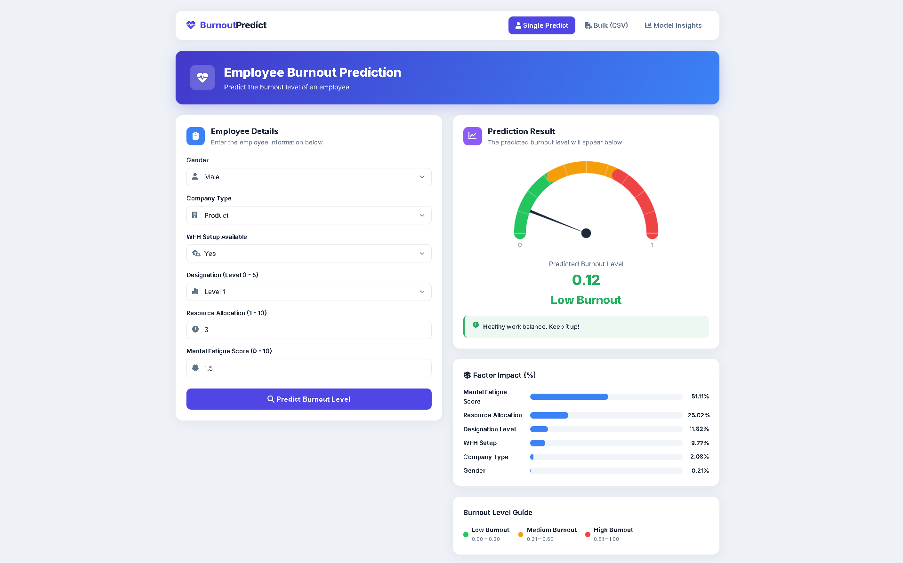
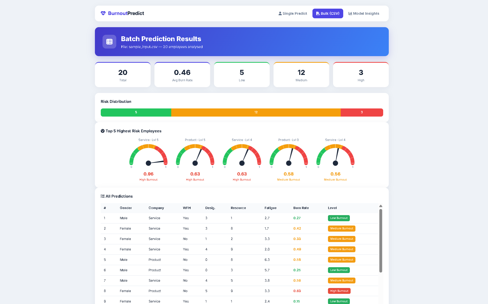
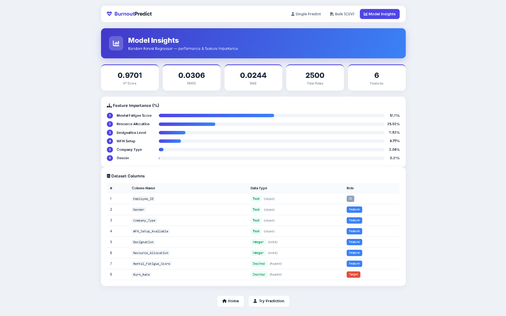

# 🧠 Employee Burnout Prediction using Machine Learning

An Artificial Intelligence and Machine Learning project that predicts employee **burnout levels (0 – 1)** using workplace and behavioral factors. The system uses a supervised **Random Forest Regression** algorithm to analyze employee data, output a precise burnout score, and classify the risk into **Low**, **Medium**, or **High** categories.

The project combines **Data Preprocessing**, **Feature Engineering**, **Machine Learning Model Training**, **Feature Importance Analysis**, and **Flask Deployment** to deliver real-time burnout predictions through an interactive multi-screen web application — supporting both **single-employee** and **bulk CSV** predictions.

---

## 🚀 Project Highlights

* Machine Learning-Based Burnout Score Prediction (0 – 1)
* Random Forest Regression Model
* Feature Importance Analysis (which factor impacts how much %)
* Interactive Animated Speedometer Gauge (0 = left, 1 = right)
* Single-Employee Real-Time Prediction
* Bulk CSV Batch Prediction with Summary Dashboard
* Model Insights Page (R², RMSE, MAE + Feature Importance)
* End-to-End ML Deployment with Flask
* Modern Responsive User Interface

---

## 📊 Problem Statement

Employee burnout is a growing challenge in modern workplaces, leading to reduced productivity, lower employee satisfaction, and increased turnover rates.

This project aims to identify employees who may be at risk of burnout by analyzing workplace-related attributes and predicting a continuous **burnout score** using Machine Learning, while also revealing **which factors contribute most** to that prediction.

---

## 🎯 Objectives

* Predict employee burnout score (0 – 1) using Machine Learning
* Analyze workplace and behavioral factors affecting burnout
* Quantify the percentage impact of each factor on the prediction
* Classify employees into Low / Medium / High risk categories
* Support HR teams in proactive employee wellness management
* Enable both single-record and bulk (CSV) predictions
* Demonstrate an end-to-end Machine Learning deployment pipeline

---

## 📂 Project Structure

```text
Employee-Burnout/
│
├── index.py                 # Main Flask application
├── model.py                 # ML model: train, predict, save/load
├── requirements.txt
│
├── burnout_dataset.csv      # Auto-generated dataset
├── burnout_model.pkl        # Auto-generated trained model
├── encoders.json            # Auto-generated label encoders
├── scaler.json              # Auto-generated feature scaler
├── metrics.json             # Auto-generated saved metrics
│
├── static/
│   ├── css/
│   │   └── style.css
│   │
│   ├── js/
│   │   └── speedometer.js    # Canvas-based gauge
│   │
│   └── uploads/              # Stores uploaded CSV files
│
└── templates/
    ├── base.html             # Shared layout + navbar
    ├── predict_single.html   # Single prediction (main page)
    ├── predict_csv.html      # Bulk CSV upload page
    ├── csv_results.html      # Batch results dashboard
    └── model_info.html       # Model insights & feature importance
```

---

## 📁 Project Components

### `generate_dataset.py`

Responsible for:

* Generating a realistic Employee Burnout dataset
* Creating correlated features and a target `Burn_Rate` (0 – 1)
* Saving the dataset as `burnout_dataset.csv`

### `model.py`

Responsible for:

* Dataset Loading & Validation
* Categorical Feature Encoding
* Numerical Feature Scaling
* Random Forest Model Training
* Feature Importance Computation
* Prediction Logic
* Model / Encoder / Scaler Save & Load

### `index.py`

Flask application responsible for:

* User Interface Integration
* Request Handling & Routing
* Single & Bulk (CSV) Real-Time Predictions
* Burnout Level Classification
* Model Insights Endpoint
* Sample CSV Download

### Frontend

| Layer | Purpose |
|-------|---------|
| **HTML** (Jinja2) | Interactive employee input form + result dashboards |
| **CSS** | Modern, responsive, light-themed UI |
| **JavaScript** | Animated speedometer gauge & dynamic result rendering |

---

## 🤖 Machine Learning Workflow

### 1. Data Collection / Generation

The model is trained on an Employee Burnout dataset containing employee demographic and workplace-related attributes with a continuous burnout target.

### 2. Data Preprocessing

* Missing Value Handling
* Data Cleaning
* Feature Selection
* Categorical Encoding (Label Encoding)
* Numerical Feature Scaling (StandardScaler)

### 3. Feature Engineering

The following features are used for prediction:

| Feature                  | Type    | Description                |
| ------------------------ | ------- | -------------------------- |
| Gender                   | Text    | Male / Female              |
| Company Type             | Text    | Product / Service          |
| WFH Setup Available      | Text    | Yes / No                   |
| Designation              | Integer | Employee Designation Level (1 – 5) |
| Resource Allocation      | Integer | Workload Allocation (1 – 10) |
| Mental Fatigue Score     | Decimal | Employee Fatigue Level (0 – 10) |

---

## 🎯 Target Variable

The model predicts a continuous **Burn Rate** between **0 and 1**, which is then mapped into burnout categories:

| Burn Rate   | Burnout Level | Color  |
| ----------- | ------------- | ------ |
| ≤ 0.30      | Low           | 🟢 Green |
| 0.31 – 0.60 | Medium        | 🟠 Orange |
| > 0.60      | High          | 🔴 Red |

This makes it a **supervised regression** problem with category-based interpretation.

---

## 🧮 Machine Learning Algorithm

### Random Forest Regressor

The project uses the **Random Forest Regression Algorithm** from Scikit-Learn.

#### Why Random Forest?

* High Predictive Accuracy
* Handles Mixed Data Types
* Resistant to Overfitting (ensemble of trees)
* Provides Built-in **Feature Importance**
* Robust to Outliers and Noise
* Requires Minimal Data Preparation

> The **feature importance** output from Random Forest is what powers the "Factor Impact (%)" visualization, showing how much each factor contributes to the prediction.

---

## 🔬 Model Training Process

1. Load / Generate Employee Burnout Dataset
2. Validate & Clean Dataset
3. Encode Categorical Features
4. Scale Numerical Features
5. Split Dataset into Training (80%) and Testing (20%) Sets
6. Train Random Forest Regressor
7. Evaluate using R², RMSE, MAE
8. Compute Feature Importance
9. Save Model, Encoders, Scaler & Metrics
10. Deploy with Flask

---

## 📈 Prediction Categories

### 🟢 Low Burnout — `0.00 – 0.30`

Employee is working under healthy conditions with manageable stress levels.

### 🟠 Medium Burnout — `0.31 – 0.60`

Employee may be experiencing moderate work-related strain and should be monitored.

### 🔴 High Burnout — `0.61 – 1.00`

Employee is likely experiencing significant burnout and may require intervention.

---

## 🖥️ Application Workflow

### Single Prediction
1. User enters employee details in the form.
2. Data is sent to the Flask backend.
3. Features are encoded and scaled.
4. Random Forest model generates a burnout score.
5. Burnout category is determined.
6. Animated **speedometer** displays the score (0 → 1).
7. **Factor Impact (%)** breakdown is shown.
8. A recommendation message is displayed.

### Bulk CSV Prediction
1. User uploads a CSV of multiple employees.
2. Every row is predicted automatically.
3. A summary dashboard shows totals & risk distribution.
4. Top-5 highest-risk employees are shown with mini gauges.
5. A full results table lists all predictions.

---

## 🖼️ Application Screens

| Screen | Route | Description |
|--------|-------|-------------|
| **Single Predict** | `/` | Form + speedometer + factor impact + guide |
| **Bulk CSV** | `/predict/csv` | Drag-drop CSV upload + sample download |
| **CSV Results** | (after upload) | Summary cards + distribution + top-5 gauges + table |
| **Model Insights** | `/model/info` | R² / RMSE / MAE + feature importance + dataset columns |

---

## 🛠️ Technologies Used

### Programming Language
* Python

### Machine Learning
* Scikit-Learn
* Random Forest Regressor
* StandardScaler & LabelEncoder

### Data Analysis
* Pandas
* NumPy

### Web Development
* Flask
* HTML5
* CSS3
* JavaScript (Canvas API for gauge)

### Development Environment
* Visual Studio Code

---

## 📚 Machine Learning Concepts Demonstrated

* Supervised Learning
* Regression
* Ensemble Methods (Random Forest)
* Feature Engineering
* Feature Importance Analysis
* Data Preprocessing & Scaling
* Model Training & Evaluation (R², RMSE, MAE)
* Model Persistence (Save / Load)
* Model Deployment
* AI-Based Prediction Systems

---

## 💼 Real-World Applications

* Human Resource Analytics
* Employee Wellness Monitoring
* Workforce Risk Assessment
* Employee Retention Programs
* Organizational Performance Analysis
* AI-Powered Decision Support Systems

---

## ▶️ Installation & Setup

### Clone Repository

```bash
git clone https://github.com/kano8689/Employee-Burnout.git
cd Employee-Burnout
```

### Install Dependencies

```bash
pip install -r requirements.txt
```

### Run Application

```bash
python index.py
```

> On first run, the dataset and model are generated automatically.

### Open Browser

```text
http://127.0.0.1:5000
```

---

## 📦 requirements.txt

```text
flask
numpy
pandas
scikit-learn
```

---

## 📸 Project Screenshots

### Single Prediction Dashboard


### Bulk CSV Prediction


### Model Insights


The interactive dashboard allows users to enter employee information (or upload a CSV) and receive real-time burnout predictions with a visual gauge and per-factor impact analysis.

---

## 🎓 Learning Outcomes

Through this project, I gained hands-on experience in:

* Machine Learning Model Development
* Random Forest Regression
* Feature Importance Analysis
* Data Cleaning, Encoding & Scaling
* Feature Engineering
* Flask Web Development
* Model Deployment & Persistence
* Frontend ↔ Backend Integration
* Canvas-based Data Visualization
* Building End-to-End AI Applications

---

## 👨‍💻 Author

**Krishnam Mavani**

* GitHub: https://github.com/kano8689
* Live Link: https://employee-burnout-two.vercel.app/

---

## ⭐ Support

If you found this project helpful, please consider giving it a ⭐ on GitHub.

It helps support future AI, Machine Learning, and Data Analytics projects.

---

## 📝 Key Differences from a Basic Version

| Feature | This Project |
|---------|--------------|
| Algorithm | **Random Forest Regressor** (not just a single tree) |
| Output | Continuous score **0 – 1** + category |
| Explainability | **Feature Importance %** per prediction |
| Input Modes | **Single form + Bulk CSV upload** |
| Visualization | **Animated speedometer gauge** |
| Insights | Dedicated **Model Insights** page (R², RMSE, MAE) |